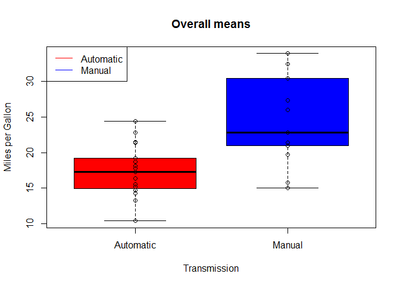

# Analyze transmission type influence on fuel efficiency
Evgeny Kuznetsov  

## Synopsis

This is Regression Models Course Project. In this project, we analyze transmission type (AM) influence on fuel efficiency (MPG) 
basing on mtcars dataset. 

## Exploratory analyses


```r
data(mtcars) # load data

t.test(mpg ~ am, data = mtcars) # perform t.test
```

```
## 
## 	Welch Two Sample t-test
## 
## data:  mpg by am
## t = -3.7671, df = 18.332, p-value = 0.001374
## alternative hypothesis: true difference in means is not equal to 0
## 95 percent confidence interval:
##  -11.280194  -3.209684
## sample estimates:
## mean in group 0 mean in group 1 
##        17.14737        24.39231
```

We have highly different means in these two groups. See also appendix A for means' graph.

## Regression analyses


```r
minimum_fit <- lm(mpg ~ am, data = mtcars) # calculate minimum model

full_fit <- lm(mpg ~ . , data = mtcars) # calculate full model

reduced_fit <- step(full_fit, trace = 0) # calculate reduced model

AIC(minimum_fit, full_fit, reduced_fit) # calculate An Information Criterion
```

```
##             df      AIC
## minimum_fit  3 196.4844
## full_fit    12 163.7098
## reduced_fit  5 154.1194
```


Our strategy is to use model with minimum on An Information Criterion. Reduced model has minimum on AIC - 154.12. So, let's use this model.


```r
summary(reduced_fit)
```

```
## 
## Call:
## lm(formula = mpg ~ wt + qsec + am, data = mtcars)
## 
## Residuals:
##     Min      1Q  Median      3Q     Max 
## -3.4811 -1.5555 -0.7257  1.4110  4.6610 
## 
## Coefficients:
##             Estimate Std. Error t value Pr(>|t|)    
## (Intercept)   9.6178     6.9596   1.382 0.177915    
## wt           -3.9165     0.7112  -5.507 6.95e-06 ***
## qsec          1.2259     0.2887   4.247 0.000216 ***
## am            2.9358     1.4109   2.081 0.046716 *  
## ---
## Signif. codes:  0 '***' 0.001 '**' 0.01 '*' 0.05 '.' 0.1 ' ' 1
## 
## Residual standard error: 2.459 on 28 degrees of freedom
## Multiple R-squared:  0.8497,	Adjusted R-squared:  0.8336 
## F-statistic: 52.75 on 3 and 28 DF,  p-value: 1.21e-11
```

Our residual diagnose for chosen model that it explains 84.97% of variance with an adjustment to 83.36%. See also appendix B for residuals plots.


```r
confint(reduced_fit) # take confidence interval
```

```
##                   2.5 %    97.5 %
## (Intercept) -4.63829946 23.873860
## wt          -5.37333423 -2.459673
## qsec         0.63457320  1.817199
## am           0.04573031  5.825944
```


Our quantitive value for manual transimission improvement is 2.94 ± 2.89 with 95% confidence interval. 


## Executive Summary

After analyses we conclude the following:

* manual transmission is better for MPG
* manual transmission increase MPG by 2.94 ± 2.89 with 95% confidence interval


\newpage

## Appendix A


```r
boxplot(mpg ~ factor(am, labels = c("Automatic", "Manual")), data = mtcars, 
  col = c("red", "blue"), main = "Overall means", xlab = "Transmission",
  ylab = "Miles per Gallon") 
points(mpg ~ factor(am, labels = c("Automatic", "Manual")), data = mtcars)
legend("topleft", c("Automatic", "Manual"), lty = 1, col = c("red", "blue"))
```

 

\newpage

## Appendix B


```r
par(mfrow = c(2, 2))
plot(reduced_fit)
```

 

